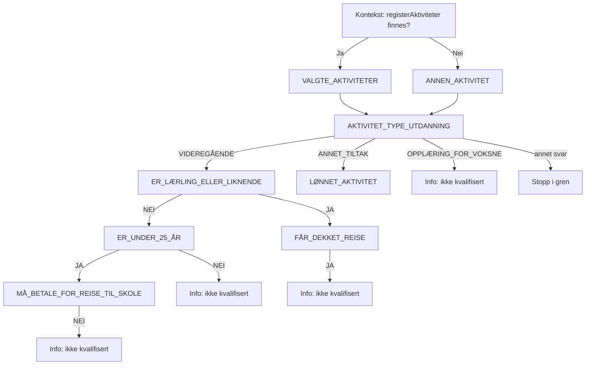

```mermaid
flowchart TD
    K1["Kontekst: registerAktiviteter finnes?"] -->|Ja| Q1["VALGTE_AKTIVITETER"]
    K1 -->|Nei| Q2["ANNEN_AKTIVITET"]

    Q1 --> Q3["AKTIVITET_TYPE_UTDANNING"]
    Q2 --> Q3

    Q3 -->|VIDEREGÅENDE| Q4["ER_LÆRLING_ELLER_LIKNENDE"]
    Q3 -->|ANNET_TILTAK| Q8["LØNNET_AKTIVITET"]
    Q3 -->|OPPLÆRING_FOR_VOKSNE| I1["Info: ikke kvalifisert"]
    Q3 -->|annet svar| E1["Stopp i gren"]

    Q4 -->|JA| Q5["FÅR_DEKKET_REISE"]
    Q4 -->|NEI| Q6["ER_UNDER_25_ÅR"]

    Q6 -->|JA| Q7["MÅ_BETALE_FOR_REISE_TIL_SKOLE"]
    Q6 -->|NEI| I2["Info: ikke kvalifisert"]

    Q5 -->|JA| I3["Info: ikke kvalifisert"]
    Q7 -->|NEI| I4["Info: ikke kvalifisert"]
```
