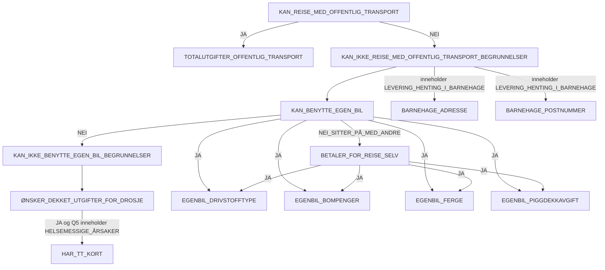

```mermaid
flowchart TD
    Q1["KAN_REISE_MED_OFFENTLIG_TRANSPORT"] -->|JA| Q2["TOTALUTGIFTER_OFFENTLIG_TRANSPORT"]
    Q1 -->|NEI| Q3["KAN_IKKE_REISE_MED_OFFENTLIG_TRANSPORT_BEGRUNNELSER"]

    Q3 --> Q4["KAN_BENYTTE_EGEN_BIL"]
    Q3 -->|inneholder LEVERING_HENTING_I_BARNEHAGE| Q3A["BARNEHAGE_ADRESSE"]
    Q3 -->|inneholder LEVERING_HENTING_I_BARNEHAGE| Q3B["BARNEHAGE_POSTNUMMER"]

    Q4 -->|NEI| Q5["KAN_IKKE_BENYTTE_EGEN_BIL_BEGRUNNELSER"]
    Q5 --> Q6["ØNSKER_DEKKET_UTGIFTER_FOR_DROSJE"]
    Q6 -->|JA og Q5 inneholder HELSEMESSIGE_ÅRSAKER| Q7["HAR_TT_KORT"]

    Q4 -->|NEI_SITTER_PÅ_MED_ANDRE| Q8["BETALER_FOR_REISE_SELV"]

    Q4 -->|JA| Q9["EGENBIL_DRIVSTOFFTYPE"]
    Q4 -->|JA| Q10["EGENBIL_BOMPENGER"]
    Q4 -->|JA| Q11["EGENBIL_FERGE"]
    Q4 -->|JA| Q12["EGENBIL_PIGGDEKKAVGIFT"]

    Q8 -->|JA| Q9
    Q8 -->|JA| Q10
    Q8 -->|JA| Q11
    Q8 -->|JA| Q12
```
